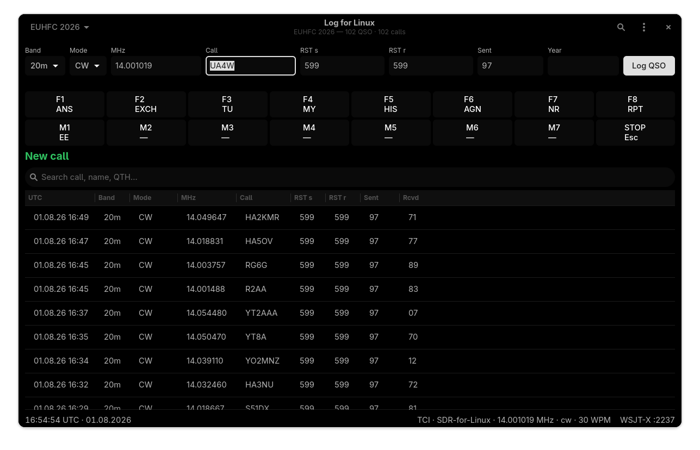

# Log for Linux

**A native GTK4/libadwaita ham radio logbook for Linux.** The third app in the
family around [`sdr-for-linux`](https://github.com/OK1BR/sdr-for-linux) (SDR
transceiver) and
[`skimmer-for-linux`](https://github.com/OK1BR/skimmer-for-linux) (CW/RTTY/PSK
skimmer), sharing their technology and architecture: a headless, GLib-only
engine under a GTK4/libadwaita front-end, plain C11, meson, SQLite. Successor
of the retired Rust prototype (BRlog).

> **Status: 0.1.0 — a usable daily logbook.** Everything below is implemented,
> covered by offline test gates, and was run in anger through a full
> **EUHF Challenge 2026** CW deployment — live entry, macros, serials, dup
> checking and the Cabrillo submission all came from this app. Details and
> the milestone plan: [`docs/SCOPE.md`](docs/SCOPE.md).



## Features

**Logging**
- Fast entry row with UTC clock: callsign, RST (per-mode defaults — 59 phone,
  599 CW, blank FT8/FT4), frequency ↔ band auto-sync, name, comment;
  **Enter anywhere logs**
- Live **worked-before verdict while you type** — green *New call*, or B4
  counts per band / band+mode with the last-worked date; a same
  call+band+mode duplicate within 5 minutes asks before logging
- **QSO table** in the main window (virtualized `GtkColumnView`, newest
  first): search with debounce, **single click edits any cell in place**
  (UTC, call, band, MHz, mode/submode, RSTs, exchange, name, comment),
  right-click deletes with confirmation
- **SQLite store** — one file, WAL mode, schema migrations; worked-B4, dup
  checks and statistics are indexed queries, not log scans
- **ADIF 3.1 import/export with a lossless round-trip**: fields the app does
  not model are preserved verbatim and written back on export; the parser
  tolerates real-world quirks (case, CRLF, missing `<EOH>`, truncated
  records); import dedups against the log and reports counts

**Contesting**
- **Contests as first-class log sections**: create/switch/delete from the
  header, each contest copies its exchange template at creation. Presets for
  CQ WW, CQ WPX, IARU HF, OK/OM DX, EUHFC, plus a custom template editor
  (serial / number / text / auto fields mapped onto ADIF). The main-log view
  stays clean — contest QSOs live in their section, while worked-B4 and
  statistics stay global
- Per-contest **sent serials**, whole-contest dup rule (call+band+mode),
  received-exchange fields in the entry row, exchange column in the table
- **Cabrillo v3 export** of the active contest: category dialog with
  spec-value dropdowns (persisted), exact-QRG kHz, correct mode letters,
  chronological order — ready for robot submission
- **CW contest messaging** via the radio's keyer (TCI): F1–F8 macro strip
  with separate **Run and S&P banks**, right-click or Preferences editing,
  tokens `{MYCALL}` `{CALL}` `{RST}` `{NR}` `{EXCH}`; optional **ESM**
  (Enter Sends Message), opt-in **cut numbers** (0T 1A 9N …, log keeps real
  digits), **Ctrl+K** free-text CW window, Esc stops the keyer,
  **Page Up/Down nudges keyer WPM** from anywhere

**Integration**
- **TCI client** to `sdr-for-linux` (`ws://127.0.0.1:40001`): the entry row
  pre-fills frequency, band and mode from the live VFO; **clicking a skimmer
  spot on the panadapter drops the callsign into the Call entry** with the
  worked-B4/dup verdict run as if typed; CW macros key the radio; automatic
  reconnect
- **WSJT-X / JTDX auto-logging** (UDP `127.0.0.1:2237`, schema 2/3): every
  *QSO Logged* lands in the store (dup-safe), and decode lists get
  worked-before **Highlight Callsign** replies (green = new, yellow = B4)
- **Duplicate lookup service for `skimmer-for-linux`** (UDP `127.0.0.1:2238`,
  always on): `DUP? <call> <freq_hz> <mode>` → `NEW|B4|DUP`, so the skimmer
  colors its spots from your log; verdict-changing edits are pushed to
  recent peers unsolicited, so spot colors update the moment you log
- **Safety/etiquette by design**: the logbook never transmits and never
  changes radio state except operator-triggered CW macros and keyer speed;
  nothing leaves the machine without an explicit action

## Requirements

C11 compiler, `meson`/`ninja`, and development files for **GTK 4**,
**libadwaita**, **GLib/GIO**, **SQLite** and **libwebsockets**.

Arch: `pacman -S --needed gcc meson gtk4 libadwaita glib2 sqlite
libwebsockets` (equivalent `-dev`/`-devel` packages on other distributions).

## Build & install

```
meson setup builddir
meson compile -C builddir
meson test -C builddir          # 9 offline gates, no hardware needed
./builddir/log-for-linux
```

Install into the user prefix (desktop file, icon and AppStream metainfo
included — the app shows up in the app grid):

```
meson setup builddir --prefix=$HOME/.local
meson compile -C builddir
meson install -C builddir
```

## Where your data lives

| What | Where |
|---|---|
| Log (SQLite, WAL) | `~/.local/share/log-for-linux/log.db` |
| Preferences (TCI, station, macros, ESM, WSJT-X) | `~/.config/log-for-linux/settings.ini` |
| ADIF | interchange only — import/export from the window menu |

The store file is the canonical log; back it up like one. ADIF export always
covers everything by default, so a periodic `.adi` export doubles as a
portable backup.

## Roadmap

Next milestones (see [`docs/SCOPE.md`](docs/SCOPE.md) for the full plan and
the decisions behind it):

- **M7 — callbook lookup**: QRZ.com / HamQTH auto-fill of name/QTH/grid on
  callsign entry, on-disk cache, credentials in the system keyring
- **M8 — QSL sync**: LoTW (sign + upload via `tqsl`, confirmation pull),
  eQSL, Club Log; per-QSO sent/confirmed state per service
- Later: DXCC/awards tracking (worked/confirmed matrices per band/mode),
  contest scoring/multipliers

A cluster/telnet spot window is deliberately **out of scope** — the skimmer
already renders spots on the panadapter, and one click there pre-fills the
log.

## License

GPL-3.0-or-later. © Richard Fakenberg, OK1BR.
